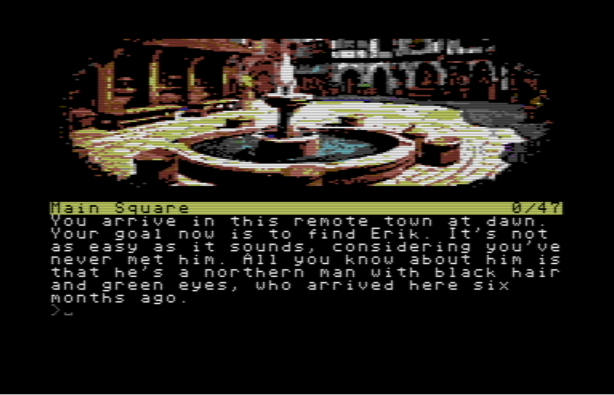

# Nesterin-Trail
A storytllr-based C64 fantasy text adventure

# Preface

You are the youngest member of the Garrot Guild, or what is left of it. Most of those loyal to the Duke were killed after the brutal and unexpected Lyrin invasion that so changed the land in which you were born.
But though few remain, and they must work in secret, your master's research has not ceased. And it is more important than ever.
You know little of it, the old arts being so difficult for you, but you have other useful skills. You know how to move about unnoticed, and you know how to blend in, thanks in part to your mixed race.
So you were not surprised when you were sent to Nesterin, one of the settlements near the old Lyrin border, to get hold of Erik's report, whatever it might contain. 
You've never met him, but you know that his qualities are second to none, and if the Master took the risk of sending him so far, it could mean that something really important is at stake.
To be honest, you've long since lost hope of a breakthrough that would give the small resistance a chance of victory, but you certainly haven't lost the will to fight.

# Getting started

You arrived in Nesterin not knowing what to expect and found a frightened and desperate place, mostly without male adults, full of armed Lyrin men, where even food was becoming a problem. But even without taking this general situation into account, something else must have happened just before you arrived, and it may have something to do with Erik.
If so, be careful. And remember that you may need to find a safe place while you try to get information.
So you plan to move around, in the city or just outside the walls, observe everything, talk to everyone available, and blend in. It's not your first rodeo, and you certainly don't want it to be your last.

# Generic Game Tips

In this game, you'll have to talk to some characters and ask them for information. Some of them will be more friendly once they understand your side.

You'll also find various useful items, but you can't take them all at once, so you'll need to understand what you need to carry with you at specific times.
For this reason, actions that make a specific object available (i.e hunting for something) don’t also necessarily put the object directly in your inventory, but just “on the ground”. So it’s wise to check it.

This is more of a spy story than a swashbuckling one, so be prepared to do a lot of investigating and reading, and avoid confrontation as much as possible. Remember that the Lyrins won against your people not just because they launched an invasion without warning, but mainly because they're strong and restless, with almost impenetrable armour and swords that can cut through anything. You're a young boy carrying a hunting knife.

# Tips about some locations

## The Inn

The inn near the main square is a good place to start your research. It might also be a good place to store your things in case you need to do so. That, if you can get into one of the rooms.

## The School

There used to be a large school in this town, but it's now closed and boarded up. Why is that? Even if it's forbidden, or because of it, it might be a good idea to go in and have a look around.

## The School Library

Bigger than any library you have ever entered (even if, to be fair, your experience is limited), this source of information could play a central role in your research.

## The Market

A market is, in your experience, a good place to hear rumors and maybe find something useful. Of course, you'll need money to do this, and you don't have any.

## Prison

Nesterin, being a rich place in the past, has a big prison. And now it's run by Lyrins. You probably don't want to enter it, but maybe they have a reason.

## Southern Forest

The forest south of Nesterin is deep and difficult to navigate without a map. It's full of herbs and was used for hunting in the recent past, at least before Lyrins took all the weapons away from the citizens. It's also a place of scary fairy tales. Some people believe that an evil witch lives there, hidden somewhere.

## Northern Forest

As far as you know, the Northern Forest is where Lyrin's land begins. They were considered by your people to be a nomadic population of several different tribes, terrible in their savage way of life, full of lore and rituals, but not a real danger, and small-scale trade took place all the time. Mountains, including those where the silver mines are located, separated the two territories, and few of your people usually ventured into theirs.   

## The Mines

The silver mines were the source of wealth for the whole region. Now they're under Lyrin's direct control, and none of you know anything about what goes on there, nor do you see wagons full of silver leaving the area. Surely Lyrins has put a lot of men there to make sure no one can get there without them knowing.

# How to play

You can move around and explore Nesterin and its surroundings, and interact with people or objects using simple instruction in the form of verb or verb element or verb elementA and elementB.
The parser is a bit tolerant so you can write in a longer way if you prefer that (i.e. you can "put item1 inside the item2" instead of "put item1 item2"), and it lets also write a short version of the most common commands (x for examine or l for look, n for north, i for inventory and so on), but don't expect it can always understand you, so please try to use simple forms, and or reformulate a request is you think it should work and it doesn't.

This is an almost complete list of usable verbs (not necessarily all useful or even needed): 

**movement**: u d s n w e se sw ne nw

**object/place analysis**: examine, look, read, search

**object interaction**: take drop use push pull open close put drink eat fill wear take off insert copy move cast throw cut

**actor interaction**: show give talk ask attack kill

In the game you can also use few special commands:

**inventory** = show what you’re carrying with you

**save/load** = you can save/load your status inside the game directly on game disk. ONE save, that’ll be overwritten.

**restart/quit** = these commands let you start again or abandon the game

**gfx** = with this command you can ask for a progressive loading of images - or to have a static image

you can also use 

**look exits**

to see evident exits from a place

**go back to nesterin** (or even just go nesterin)

when outside town, and in a open field, will take you back to the nearest city entrance without having to type all the needed direction steps
Walkthrough
Even though there is only one possible ending (you can't die), there is of course no single sequence of actions to get there. But if you're stuck somewhere and/or would like a little help (I think it's more than possible, maybe just for a too strict command to do something), I've also provided a full walkthrough, suggesting that you search for places or objects inside it, instead of following it directly.

